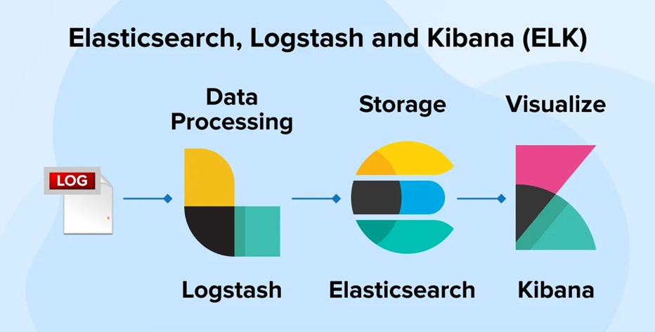
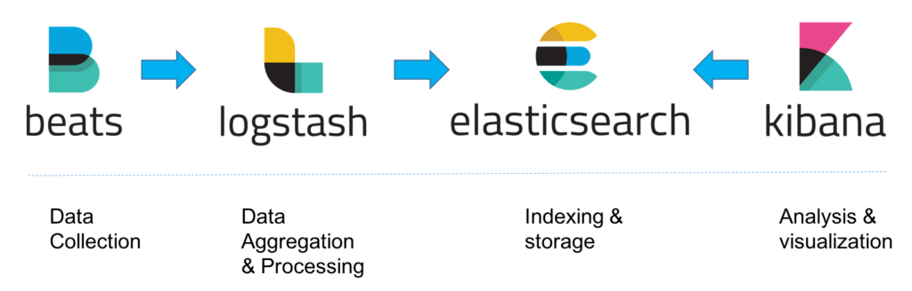

## Monitoring
https://medium.com/@muppedaanvesh/a-hands-on-guide-to-kubernetes-logging-using-elk-stack-filebeat-part-4-%EF%B8%8F-48e233443961

<p align="left">
  
  
</p>

### Objective:
Deploy a complete monitoring and observability solution.

Requirements:
Deploy ELK Stack inside Kubernetes.

Components:  
| Component     | Type         | Purpose:          |
---------------------------------------------------|
| Elasticsearch | Stateful Set | store everything  |
| Kibana        | Deployment   | visualization     |
| Logstash      | Deployment   | log processing    |
| Filebeat      | Daemon Set   | log collection    |
| Metricbeat    | Daemon Set   | metric collection | 
| APM Server    | Deployment   | trace collection  |
|--------------------------------------------------|


### Monitoring Requirements:
The platform must collect:

Metrics - Collect metrics from all Kubernetes components.

Logs - Collect logs from:
Frontend
Backend
Database
Jenkins
ArgoCD
Nexus

Traces - Collect traces across the platform.

### Elasticsearch

helm repo add elastic https://helm.elastic.co

helm install elasticsearch elastic/elasticsearch -n logging
helm install kibana elastic/kibana -n logging
helm install logstash elastic/logstash -n logging
helm install filebeat elastic/filebeat -n logging
helm install metricbeat elastic/metricbeat -n logging
helm install apm-server elastic/apm-server -n logging


### Prerequisites
```
curl -fsSL https://raw.githubusercontent.com/helm/helm/main/scripts/get-helm-3 | bash
helm version
kubectl create namespace monitoring

kubectl -n monitoring get all,secrets,svc,configmap,crd,job
```


### Step 1: Install Elasticsearch
```
# 1. Add the Elastic Helm repository
  helm repo add elastic https://helm.elastic.co
  helm repo update
  # View availible elasticsearch versions
  helm search repo elastic/elasticsearch --versions | head -20

# 2. Create a elasticsearch-values.yaml
# 3. Install Elasticsearch:
  helm install elasticsearch elastic/elasticsearch -n monitoring -f ./monitoring/elasticsearch-values.yaml
  # Check if cluster in life
  helm --namespace=monitoring test elasticsearch

```
### Step 2: Configure and Install Logstash
```
# 1. Create a logstash-values.yaml file 
# 2. Install Logstash using Helm:
  helm install logstash elastic/logstash -n monitoring -f ./monitoring/logstash-values.yaml
  helm uninstall logstash -n monitoring
```
### Step 3: Configure and Install Filebeat
```
# 1. Create a filebeat-values.yaml file
# 2. Install Filebeat using Helm:
  helm install filebeat elastic/filebeat -n monitoring  -f ./monitoring/filebeat-values.yaml
  helm uninstall filebeat -n monitoring 
  # Check NODE
  kubectl get pods -n monitoring -o wide
```
### Step 4: Configure and Install Kibana
```
# 1. Create a kibana-values.yaml file
  helm install kibana elastic/kibana -n monitoring  -f ./monitoring/kibana-values.yaml
  helm uninstall kibana -n monitoring
  kubectl delete jobs -n monitoring -l app=kibana
```
### Step 5: Configure and Install metricbeat
```
# Check availible versions
helm search repo elastic/metricbeat --versions | head -5
helm install metricbeat elastic/metricbeat --version 8.5.1 \
  -n monitoring -f monitoring/metricbeat-values.yaml
```
### Step 6: Configure and Install apm-server for Traces
```
# Check availible versions
helm search repo elastic/apm-server --versions | head -5
helm install apm-server elastic/apm-server --version 8.5.1 \
  -n monitoring -f monitoring/apm-server-values.yaml
```
### Step 7: Access Kibana and View Logs
```
# 1. Find the NodePort assigned to Kibana:
  kubectl get svc kibana-kibana -n monitoring -o jsonpath="{.spec.ports[0].nodePort}"

# 2. Access Kibana:
  http://<EXTERNAL-IP>:<NODE-PORT>

# 3. Log in to Kibana:
  # username
  kubectl get secret -n monitoring elasticsearch-master-credentials -o jsonpath="{.data.username}" | base64 --decode
  # password
  kubectl get secret -n monitoring elasticsearch-master-credentials -o jsonpath="{.data.password}" | base64 --decode
```
### Step 8: Check Elasticsearch Cluster Health
```
# 1. Check Cluster Health from elasticsearch-pod-name or any-other-pod:
kubectl exec -it logstash-logstash-0 -n monitoring  -- curl -XGET -u elastic -vk 'https://elasticsearch-master:9200/_cluster/health?pretty'
```
### 9. Create Data View 
```
http://localhost:5601
Check in Kibana:
Go to Management → Stack Management → Index Management - the filebeat-* index should appear
Create an index pattern: Management → Kibana → Data Views → Create data view
Name:          filebeat-*
Index pattern: filebeat-*
Timestamp:     @timestamp
Go to Discover - see logs from all pods
```
### 10. View
```
Logs:
Observability → Logs → Stream # Show live logs from all pods

Metrics:
Observability → Infrastructure → Metrics Explorer # Metrics NODES and Posd from Metricbeat

Трейсы:
Observability → APM → пока пусто, нужен APM Agent в коде приложения
In frontend :
// in begining of (index.js/server.js)
const apm = require('elastic-apm-node').start({
  serviceName: 'frontend',
  serverUrl: 'http://apm-server-apm-server.monitoring.svc.cluster.local:8200',
})
// install
npm install elastic-apm-node
In backend 
# Python
import elasticapm
elasticapm.instrument()
from elasticapm import Client
client = Client({
  'SERVICE_NAME': 'backend',
  'SERVER_URL': 'http://apm-server-apm-server.monitoring.svc.cluster.local:8200'
})

All ELK Stack:
Management → Stack Monitoring → состояние Elasticsearch, Logstash, Kibana, Beats
Note: There is no data because `xpack.monitoring.enabled: false` in Logstash and Metricbeat does not send metrics about ELK itself.
```
